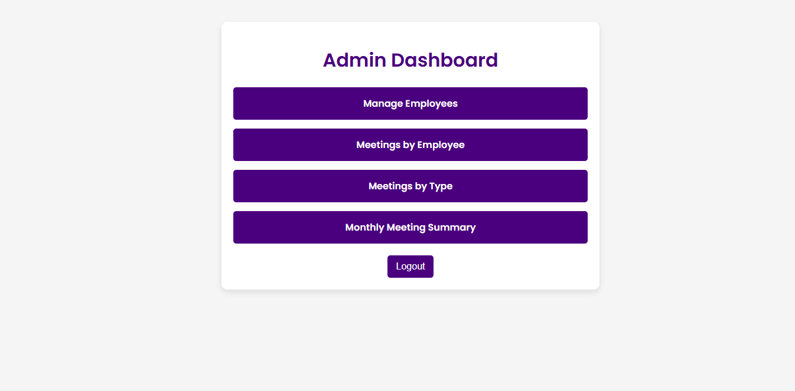
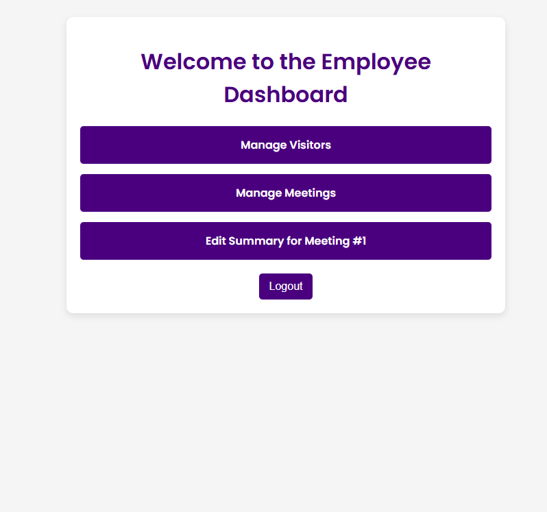

---

# **Guest Management System**

## **Project Overview**

The **Guest Management System** is a web-based application developed for **JCX Development LTD**, a real estate company in Bashundhara. The system facilitates efficient visitor scheduling, meeting management, and reporting. The primary users include **front desk employees**, **company staff**, and **administrators**.

---

## **Features**

### **1. User Roles**
- **Admin**:
  - Manage employees (add, edit, delete).
  - View detailed reports.
- **Employee**:
  - Manage visitors (add, edit, delete).
  - Schedule, edit, and manage meetings.
  - Add/edit meeting summaries.
- **Front Desk**:
  - Handle visitor entries and schedules.

### **2. Core Functionalities**
1. **Visitor Management**:
   - Add, edit, delete visitor details.
   - View detailed visitor information.

2. **Meeting Management**:
   - Schedule meetings between visitors and employees.
   - Edit meeting details (time, type, participants).
   - Add/edit meeting summaries and progress reports.

3. **Reports**:
   - Meetings by employee.
   - Meetings grouped by type.
   - Monthly meeting summaries.

4. **Authentication**:
   - Role-based access control (RBAC).
   - Admin and employee-specific dashboards.

5. **Notifications**:
   - Email notifications to employees when meetings are scheduled.

---

## **Tech Stack**

### **Backend**
- **Framework**: Laravel
- **Database**: MySQL

### **Frontend**
- **CSS Framework**: Vanilla CSS
- **JavaScript**: Vanilla JS for interactions

### **Tools**
- **Mail**: Laravel's built-in email notification system.
- **Version Control**: Git

---

## **Project Structure**

```
/guest-management-system
│
├── /app
│   ├── /Http
│   │   ├── /Controllers
│   │   │   ├── VisitorController.php
│   │   │   ├── MeetingController.php
│   │   │   ├── ReportController.php
│   │   │   ├── AuthController.php
│   │   │   └── MeetingSummaryController.php
│   │   ├── /Middleware
│   │   └── Kernel.php
│   ├── /Models
│   │   ├── User.php
│   │   ├── Visitor.php
│   │   ├── Meeting.php
│   │   └── MeetingSummary.php
│
├── /resources
│   ├── /views
│   │   ├── /auth
│   │   │   └── login.blade.php
│   │   ├── /employees
│   │   │   ├── index.blade.php
│   │   │   ├── create.blade.php
│   │   │   └── edit.blade.php
│   │   ├── /meetings
│   │   │   ├── index.blade.php
│   │   │   ├── create.blade.php
│   │   │   ├── edit.blade.php
│   │   │   └── show.blade.php
│   │   ├── /visitors
│   │   │   ├── index.blade.php
│   │   │   ├── create.blade.php
│   │   │   └── edit.blade.php
│   │   └── /reports
│   │       ├── meetings_by_employee.blade.php
│   │       ├── meetings_by_type.blade.php
│   │       └── monthly_summary.blade.php
│
├── /public
│   ├── /images
│   │   └── logo.svg
│
└── /routes
    └── web.php
```

---

## **Usage**

### **Login**
- **Admin**: `admin@example.com` / `password`
- **Employee**: `employee@example.com` / `password`

### **Admin Dashboard**
- Manage employees and generate reports.

### **Employee Dashboard**
- Manage visitors and meetings.

---

## **Screenshots**

### **Login Page**


### **Admin Dashboard**


### **Employee Dashboard**


---

## **Future Enhancements**
- Add search and filter functionalities for visitors and meetings.
- Implement advanced analytics in the reporting module.
- Integrate WhatsApp API for meeting notifications.

---

## **Project Created By**
- **Prema Haque**
---
